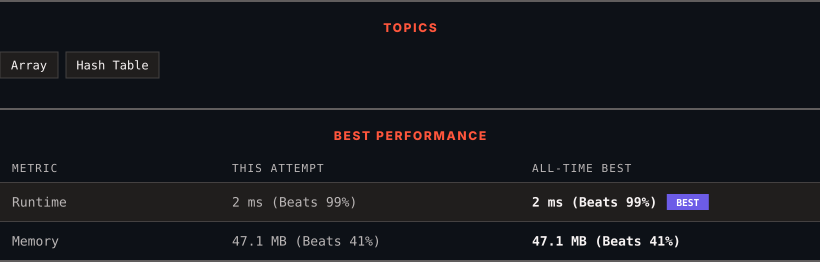

<div align="center">

# 1. Two Sum

      

[](https://leetcode.com/problems/two-sum/)

</div>

---

<div align="center">

<picture>
  <source media="(prefers-color-scheme: dark)" srcset="panel-dark.svg">
  <source media="(prefers-color-scheme: light)" srcset="panel-light.svg">
  
</picture>

</div>

> **New personal best** — Runtime improved on this submission.

### HOW IT WENT

| | |
|:--|:--|
| **Attempts** | 2 before accepted |
| **Time to solve** | 1 min |
| **Verdicts** | 🔧 Compile Error → ✅ Accepted |

---

### NOTES

_No notes yet._

---

### SOLUTIONS (1)

| # | File | Language | Date |
|:-:|------|:--------:|:----:|
| 1 | [sol1.java](./sol1.java) | `Java` | 2026-09-24 ← **latest** |

---

### PROBLEM DESCRIPTION

You are given an array of integers `nums` and an integer `target`, return *indices of the two numbers such that they add up to `target`*.

You may assume that each input would have ***exactly* one solution**, and you may not use the *same* element twice.

You can return the answer in any order.

 

**Example 1:**

```

**Input:** nums = [2,7,11,15], target = 9
**Output:** [0,1]
**Explanation:** Because nums[0] + nums[1] == 9, we return [0, 1].

```

**Example 2:**

```

**Input:** nums = [3,2,4], target = 6
**Output:** [1,2]

```

**Example 3:**

```

**Input:** nums = [3,3], target = 6
**Output:** [0,1]

```

 

**Constraints:**

	- `2 <= nums.length <= 10^4`

	- `-10^9 <= nums[i] <= 10^9`

	- `-10^9 <= target <= 10^9`

	- **Only one valid answer exists.**

 

**Follow-up: **Can you come up with an algorithm that is less than `O(n^2)` time complexity?

---

<div align="center">

<sub>Auto-synced by <strong>LeetSync</strong> · Built by <a href="https://deveshsamant.in/">Devesh Samant</a></sub>

</div>
